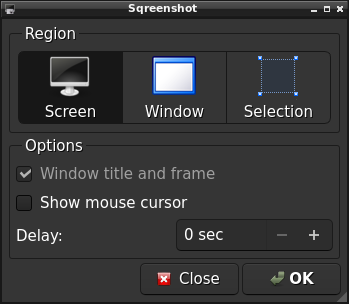

# Sqreenshot

[![CI][1]](https://github.com/redtide/sqreenshot/actions/workflows/build.yml)

Simple screenshot grabber based on [GNOME Screenshot][2].\
Currently supports only Linux platform under X11 (not Wayland).\
GPL-3.0-only license.



## Dependencies

Under Debian based systems:
- cmake
- qtbase5-dev
- qttools5-dev
- libqt5x11extras5-dev
- libxfixes-dev

## Build
```sh
cmake -B build -DCMAKE_BUILD_TYPE=Release -DCMAKE_INSTALL_PREFIX=/usr
cmake --build build
DESTDIR="$(pwd)/buildpackage" cmake --build build --target install
```

## Other similar software
- [Flameshot][3]
- [Lightscreen][4]
- [LXImage-Qt][5]
- [Screengrab][6]
- [ksnip][7]


[1]: https://github.com/redtide/sqreenshot/actions/workflows/build.yml/badge.svg
[2]: https://gitlab.gnome.org/GNOME/gnome-screenshot/
[3]: https://github.com/flameshot-org/flameshot/
[4]: https://github.com/ckaiser/Lightscreen/
[5]: https://github.com/lxqt/lximage-qt/
[6]: https://github.com/lxqt/screengrab/
[7]: https://github.com/ksnip/ksnip/